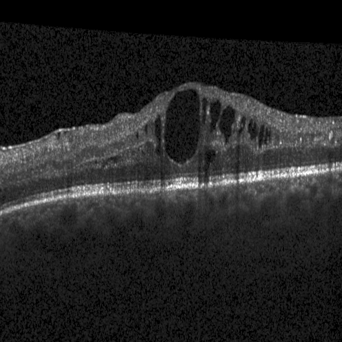
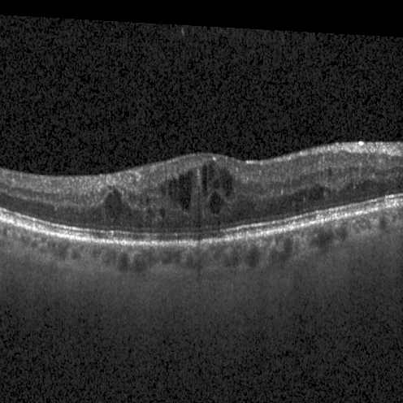
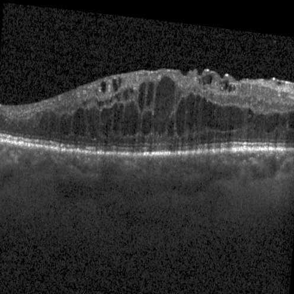
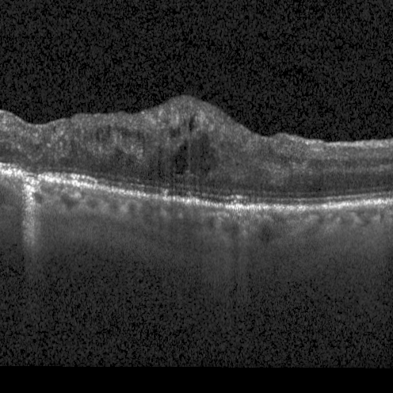

# Convert-Raw-OCT-Volumes-to-Tiff-Volumes
# OCT Raw Data Conversion Scripts

<p align="center">
  
  
</p>
<p align="center">
  
  
</p>

This repository contains Python scripts for converting raw OCT (Optical Coherence Tomography) files from Heidelberg Spectralis devices into TIFF volumes. These scripts were developed to process specific datasets from Heidelberg Spectralis OCT machines, as there weren't readily available tools for this conversion on GitHub at the time.

## Supported Formats
- `.e2e` files (Heidelberg Spectralis export format)
- `.vol` files (Heidelberg raw volume format)
- `.fda` files (Heidelberg raw data format)

## Prerequisites
```bash
pip install oct-converter
pip install numpy
pip install tifffile
pip install scikit-image
```

## Usage
Each script follows the same command-line interface pattern:
```bash
python scripts/convert_e2e_to_tiff.py /path/to/input/directory /path/to/output/directory
python scripts/convert_vol_to_tiff.py /path/to/input/directory /path/to/output/directory
python scripts/convert_fda_to_tiff.py /path/to/input/directory /path/to/output/directory
```

The scripts will:

Recursively search through the input directory for files of the respective format
Maintain the directory structure in the output location
Convert each file to a TIFF volume
Apply contrast enhancement using a double square root transformation
Save the processed volumes as float32 TIFF files

## Important Notes

These scripts were specifically developed for Heidelberg Spectralis OCT data
You may need to modify the scripts to work with your specific OCT data format or structure
The contrast enhancement (log transformation) is applied to make features more visible - remove or modify this if not suitable for your analysis
Directory structure from the input is preserved in the output

## Disclaimer
These scripts are shared as-is, primarily as a reference for others working with Heidelberg Spectralis OCT data. They may require modification to work with different versions of the file formats or different OCT machines.

## License
This repository is licensed under the MIT License (See License Info). If you are intending to use this repository for commercial use cases, please check the licenses of all Python packages used.
